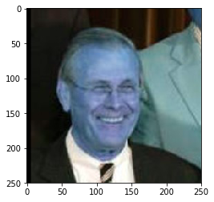
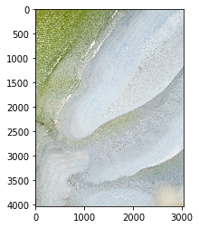
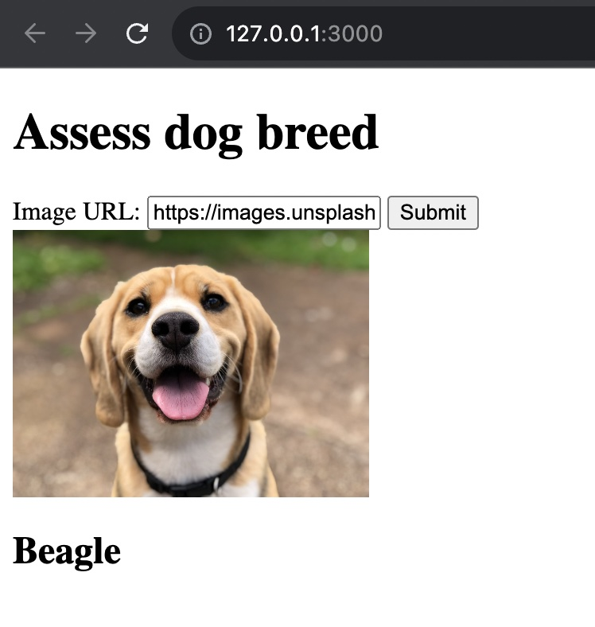

# Dog Breed Classifier Webapp

## Instructions

To run the model, use python 3.9 and install libraries from requirements.txt

```
pip3 install -r requirements.txt
```

To run BE, navigate to the webapp folder and run app.py. The application will be available on

```
http://127.0.0.1:3000
```

- The folder contains helper files (model for face identification, dog breed id etc.) in the folders
  bottleneck_features, haarcascades and saved_model as well as the dog_names pickle file
- HTML file is contained in the templates folder.
- dog_app.html is an exported version of the notebook used for the nanodegree
- model.py contains all helper functions for classification
- app.py contains the BE/routing

## Context

### Project overview

This project uses Convolutional Neural Networks (CNNs) processing user-supplied images. Given an image of a dog, the
algorithm will identify an estimate of the canine’s breed. If supplied an image of a human, the code will identify the
resembling dog breed.

### Problem statement

"Write an algorithm that accepts a file path to an image and first determines whether the image contains a human, dog,
or neither. Then,

- if a dog is detected in the image, return the predicted breed.
- if a human is detected in the image, return the resembling dog breed.
- if neither is detected in the image, provide output that indicates an error."

### Strategy
To solve this problem a series of steps were taken:

- create a face detection algorithm
- create a dog detection algorithm
- build a CNN that predicts the dog breed upon request
- build web app for user access

### Expected solution
A unified algorithm that checks the main subject based on a provided url of an image, and responds with a resembling dog breed or an error message

### Metrics

Accuracy was used as a primary metric. VGG16, VGG19 and ResNet50 were tested and Resnet with a custom configuration
provided an 78%+ accuracy

## Data

### Analysis

- There are 133 total dog categories.
- There are 8351 total dog images.
- There are 6680 training dog images.
- There are 835 validation dog images.
- There are 836 test dog images.
- There are 13233 total human images.

### Visualisations

Face tracking


Sample training images for dogs


Sample test images




Webapp



## Model
## Result

The updated Resnet model scored a 78%+ accuracy which is a substantial result compared to
the statistical <1% probability would give. This shows that the model itself was a successful approach.

For easy deploy and low resource usage, a web app was created that does not need to save images neither does it need
uploads:
users can directly enter URLs from images on the internet and run the model with those.

## Conclusion

Training the model, building the pipeline, and all building blocks of the final algorithm then porting from the
notebooks to the files and deploying it was a great challenge
that provided an E2E coverage of software, data engineering and data science.

## Improvements 
A potential improvement area could be uploading files and creating a repository of already requested files or saving
previous requests and responses and serving these from cache

## Acknowledgment

The algorithms were built on Udacity's provided CNN practice and thinking framework