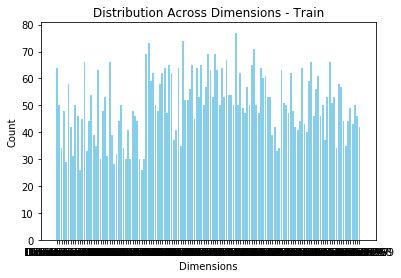
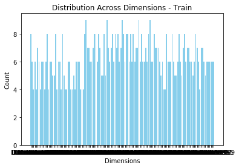
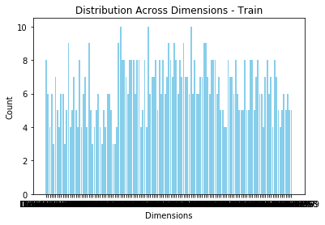
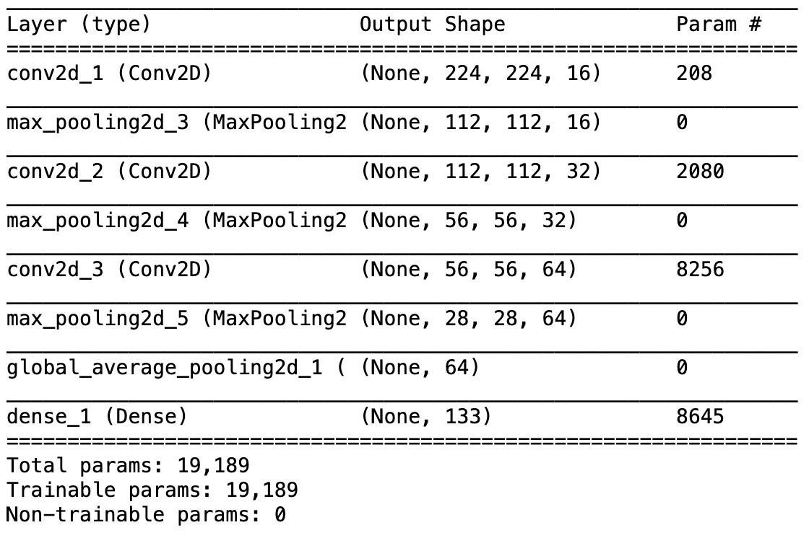

# Dog Breed Classifier Webapp

## Instructions

### How to run on local machine
1. Download folder
2. Optionally use conda environment
```
conda create --name dog-breed python=3.9
conda activate dog-breed
```
3. To run the model, use python 3.9 and install libraries from requirements.txt
```
pip3 install -r requirements.txt
```

4. To run BE, navigate to the webapp folder 
```
cd webapp
```
5. and run app.py. 
```
python app.py
```
6. The application will be available on

```
http://127.0.0.1:3000
```

7. You don't need anything else, the app will be up and running and prepopulated with an url to test 

### Git directory explanation
- The folder contains helper files (model for face identification, dog breed id etc.) in the folders
  bottleneck_features, haarcascades and saved_model as well as the dog_names pickle file
- HTML file is contained in the templates folder.
- dog_app.html is an exported version of the notebook used for the nanodegree
- model.py contains all helper functions for classification
- app.py contains the BE/routing

## Context

### Project overview

This project uses Convolutional Neural Networks (CNNs) processing user-supplied images. Given an image of a dog, the
algorithm will identify an estimate of the canine’s breed. If supplied an image of a human, the code will identify the
resembling dog breed.

### Problem statement

"Write an algorithm that accepts a file path to an image and first determines whether the image contains a human, dog,
or neither. Then,

- if a dog is detected in the image, return the predicted breed.
- if a human is detected in the image, return the resembling dog breed.
- if neither is detected in the image, provide output that indicates an error."

### Strategy

To solve this problem a series of steps were taken:

- create a face detection algorithm
- create a dog detection algorithm
- build a CNN that predicts the dog breed upon request
- build web app for user access

### Expected solution

A unified algorithm that checks the main subject based on a provided url of an image, and responds with a resembling dog
breed or an error message

### Metrics

- Accuracy Score: The accuracy score is a fundamental metric that measures the overall correctness of the model's
  predictions. It is calculated as the ratio of correctly predicted instances to the total number of instances. In the
  context of classifying dog breeds, accuracy is important because it provides a clear and easily interpretable measure
  of how well the model is performing across all classes
- F-Score: The F-score combines precision and recall into a single metric, making it more complex to interpret compared
  to accuracy. In scenarios where stakeholders, such as dog enthusiasts or veterinarians, may not be well-versed in
  machine learning metrics, a simpler metric like accuracy could be more effective in conveying the model's performance.
  Ease of interpretation is crucial

Hence, accuracy was used as a primary metric. VGG16, VGG19 and ResNet50 were tested and Resnet with a custom
configuration
provided an 78%+ accuracy

## Data

### Sources, description

The dataset for the project was provided by Udacity and loaded in with keras.

- train_files, valid_files, test_files - numpy arrays containing file paths to images
- train_targets, valid_targets, test_targets - numpy arrays containing onehot-encoded classification labels
- dog_names - list of string-valued dog breed names for translating labels

### Analysis

- There are 133 total dog categories.
- There are 8351 total dog images.
- There are 6680 training dog images.
- There are 835 validation dog images.
- There are 836 test dog images.
- There are 13233 total human images.

Image sizes vary, thus preprocessing of sizes were required (we used 224x224).
Images are RGB channeled and future images can vary in format as well.

The data is fairly uniform across classes

| Set                           | Accuracy Score |
|---------------------------------|----------------|
| train |           |
| valid               |           |
| test           |            |

### Data Preprocessing

The primary preprocessing step is contained in the path_to_tensor function that is built into all other functions

The path_to_tensor function takes a path to a color image as input and returns a 4D tensor suitable for supplying to a
Keras CNN. The function first loads the image and resizes it to a square image that is 224×224
pixels. Next, the image is converted to an array, which is then resized to a 4D tensor. In this case, since we are
working with color images, each image has three channels. Likewise, since we are processing a single image (or sample),
the returned tensor will always have shape
(1,224,224,3).

Before using the face detector specifically, detectMultiScale function is used to convert to grayscale

For training, we also rescale the images by dividing every pixel in every image by 255

### Visualisations

Face tracking


Sample training images for dogs


Sample test images


Webapp


## Model

## Modeling


First a new model was trained for reference with steps:

- Created a Sequential
- Created a convolutional layer with 16 filters, 2 kernel matching the input size with a relu activation function
- Used pooling with size 2
- Created a convolutional layer with 32 filters, 2 kernel with a relu activation function
- Used pooling with size 2
- Created a convolutional layer with 64 filters, 2 kernel with a relu activation function
- Used a pooling with size 2
- Used a global average pooling and
- Added a dense layer at the end with softmax to get probable distribution
  This only resulted in an ~1% accuracy, so Transfer learning was used.

with VGG16,19 and Resnet 50, bottleneck features were used with

- Sequential
- Global average pooling
- and a dense layer

VGG16 had 40%+ accuracy and Resnet had the highest of 78%+ so Resnet was chosen with these custom weights.

## Result

| Model                           | Accuracy Score |
|---------------------------------|----------------|
| Custom built model from scratch | 0.01%          |
| VGG16 bottlenecks               | 0.41%          |
| ResNet 50 bottlenecks           | 0.78%          |

The updated Resnet model scored a 78%+ accuracy which is a substantial result compared to
the statistical <1% probability would give. This shows that the model itself was a successful approach.

For easy deploy and low resource usage, a web app was created that does not need to save images neither does it need
uploads:
users can directly enter URLs from images on the internet and run the model with those.

## Conclusion

Training the model, building the pipeline, and all building blocks of the final algorithm then porting from the
notebooks to the files and deploying it was a great challenge
that provided an E2E coverage of software, data engineering and data science.

### Difficulties, challenges

- Integrating online URLs as file paths presented a challenge, requiring testing and adaptation of existing functions
- Additionally, restructuring routing was necessary, as the initial versions lacked proper organization, such as
  index.html file being left outside the templates folder. This restructuring aimed to improve code clarity and
  organization, adding complexity to the development process

## Improvements

A potential improvement area could be uploading files and creating a repository of already requested files or saving
previous requests and responses and serving these from cache

## Acknowledgment

The algorithms were built on Udacity's provided CNN practice and thinking framework